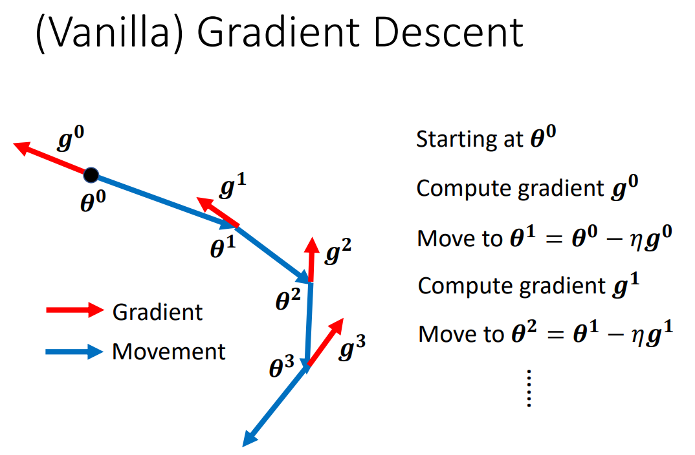
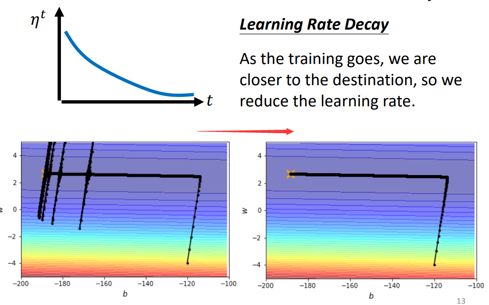
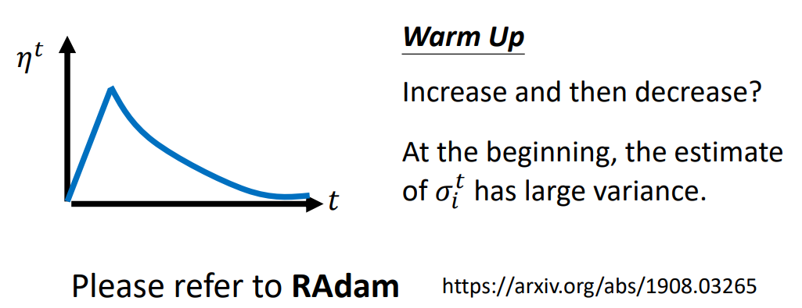

# 最优化方法

**最优化方法（Optimization Method）**即使损失函数最小化的方法，也可叫**优化器（Optimizer）**。

- 局部最优解（Local Optimum）局部最小值（Local minimum）（minimum 的复数为 minima）

- 全局最优解（Global Optimum）全局最小值（Global minimum）

- 梯度上升（Gradient Increase）

	将下降问题转化为上升问题。

## 总览

- 普通梯度下降（Vanilla Gradient Descent，Gradient Descent）
- 批次训练
  - BGD
  - SGD
  - MBGD
- 动量梯度下降（Gradient Descent with Momentum， Momentum）
  - SGD with Momentum（SGDM）
  - Nesterov Accelerated Gradient（NAG）

- 适应性学习率（Adaptive Learning Rate）
  - 自适应梯度下降（Adaptive Gradient Descent，AdaGrad）
  - 均方根传播（Root Mean Square Propagation，RMSProp）
  - 学习率调度（Learning Rate Scheduling，Scheduling）
- 梯度下降优化基（AdaGrad + Momentum + Scheduling）
- 自适应矩估计（Adaptive Moment Estimation，Adam）

## 普通梯度下降

函数在可微点沿负梯度方向下降最多。

1. 将参数表示为一个向量 $\boldsymbol \theta$ 。

2. 随机选取一个初始值 $\boldsymbol\theta_0$ 。也可随机选取多个初始值，多做几次。

3. 对全部参数求偏导 $\boldsymbol g = \nabla L(\boldsymbol \theta_i),\boldsymbol \theta_{i+1} = \boldsymbol \theta_i - \eta \boldsymbol g$ ，学习率 $\eta$ 可控制下降的跨度。

4. 不断重复迭代，直到设定次数停止或结果无法继续求偏导。

$$
\boldsymbol \theta_{i+1} \leftarrow \boldsymbol \theta_i - \eta \boldsymbol g
$$

注意，不是对输入参数求偏导，而是对参数求偏导，输入参数，输出参数和标签的值将被代入到偏导中，以计算出偏导的具体值，从而用于更新权值。

## 批次训练

- 批量梯度下降法（Batch Gradient Descent，BGD）

	每次更新使用所有样本的参数。

- 随机梯度下降法（Stochastic Gradient Descent，SGD）

	每次更新随机使用一个样本的参数。目前常说的 SGD 准确地说应该是 MBGD 。

- 小批量梯度下降法（Mini-batch Gradient Descent，MBGD）

	每次更新使用一个批次的样本的参数。

- 批次（Batch）

  将样本分批次输入神经网络进行训练，更新参数，以加速计算过程。

- Epoch

	将所有样本都分批训练完，即将训练集使用完一次，称为一个 epoch 。

- Iteration

	一个 epoch 含有的 batch 数目。

一个批次的大小（Batch Size）和进行 epoch 的次数常做为超参数。

一个样本包含神经网络的所有输入参数，一个样本的训练包含前向传播和反向传播两个过程。

在神经网络的训练过程中，训练集会被利用多次，即同一个样本会被多次输入神经网络进行训练，次数取决于 epoch 。

## Momentum

### SGDM

普通梯度下降中每次往当前梯度的反方向更新参数，而引入**动量（Momentum）**计算后，每次往当前梯度的反方向与上一次更新的（正）方向的综合方向更新参数。
$$
\boldsymbol \theta_{i+1} \leftarrow \boldsymbol \theta_i + \boldsymbol m_{i+1}\ , \ \ 
\boldsymbol m_{i+1} = \lambda \boldsymbol m_i - \eta \boldsymbol g_{i}
$$
其中，上一次动量 $m_i$ 就是上一次更新的方向，超参数 $\lambda$ 控制上一次动量的作用强度。

注意：$\boldsymbol \theta$ 是位置向量，$\boldsymbol m, \boldsymbol g$ 是方向向量。

普通算法：

动量方法：

实际上，动量 $\boldsymbol m_i$ 也可以理解为此前所有梯度 $\boldsymbol g_0, \boldsymbol g_1, \dots , \boldsymbol g_{i-1}$ 的综合：
$$
\begin{align}
\boldsymbol m_0 & = 0 \\
\boldsymbol m_1 & = -\eta \boldsymbol g_0 \\
\boldsymbol m_2 & = - \lambda \eta \boldsymbol g_0 - \eta \boldsymbol g_1 \\
& \ \ \vdots \\
\end{align}
$$
若取 $\lambda = 1$ ，有 $\boldsymbol m_i = - \eta \sum\limits^{i - 1}_{j = 0} \boldsymbol g_j$ 。

在有动量时，即使梯度为 $0$，仍然可以依靠动量提供的方向继续运动：

### NAG

Nesterov 是算法发明人。

## 适应性学习率

一般希望在平坦的位置学习率大，加快提升移动距离；在陡峭的位置学习率小，防止越过最优解。

采用动态学习率，使学习率在**每个参数**和**每个 iteration** 间动态变化大小。

对于第 $t+1$ 次更新的 $\boldsymbol \theta$ 的某一分量 $\theta^{(t+1)}_i$ ，变换学习率 $\eta \to \frac {\eta} {\sigma^{(t)}_i}$：
$$
\theta^{(t+1)}_i \leftarrow \theta^{(t)}_i - \frac {\eta} {\sigma^{(t)}_i} g^{(t)}_i
$$
需要考虑 $\sigma^{(t)}_i$ 的计算方法。

### AdaGrad

#### 策略

此前即当前的所有梯度的均方根（Root Mean Square）：
$$
\sigma^{(t)}_i = RMS(g^{(\dots)}_i) = \sqrt {\frac 1 {t + 1} \sum\limits^t_{j = 0} (g^{(j)}_i})^2
$$
当坡度平缓时，历次求得的梯度较小，从而求出的 $\sigma$ 较小，学习率变大；反之坡度陡峭时，学习率变小。

#### 缺陷

下方是两个参数的 error surface 。黑点是起点，黄叉是最优解，红色高，紫色底，黄叉上下两侧是山谷状。左侧是大学习率，在山谷震荡；右侧是小学习率，进入谷底后移动缓慢。

使用 AdaGrad 后，在 C 阶段出现异常情况：

AdaGrad 综合了此前所有的梯度。

- 在 A 阶段，横向梯度小，纵向梯度大，于是横向分量的 $\sigma$ 积累的非常小，纵向学习率小。
- 在 A 转 B 处，积累的横向分量的小 $\sigma$ 到一个程度，就使得横向学习率增大，横向大距离移动。
- 在 B 阶段，横向梯度大，纵向梯度小，于是纵向分量的 $\sigma$ 积累的非常小，横向学习率大。
- 在 B 到 C 突变处，积累的纵向分量的小 $\sigma$  到一个程度，就使得纵向学习率增大，纵向大距离移动，产生突变。
- 在 C 阶段，突变后在山谷两侧震荡，但山谷上梯度大，于是 $\sigma$ 变大，学习率变小，震荡逐步变小，然后又沿着山谷前进，反复突变，直到到达最优点。

使用 Learning Rate Scheduling 可以消除这种分量突变现象。

### RMSProp

RMSProp 是 AdaGrad 的改进，添加了超参数 $\alpha$ ，对梯度的大小做指数移动加权平均，然后开根号：
$$
\sigma^{(t)}_i = \sqrt {\alpha (\sigma^{(t-1)}_i)^2 + (1 - \alpha) (g^{(t)}_i)^2}
$$
在考虑此前及当前梯度大小的基础上，通过调整 $\alpha$ 可以调整当前梯度相对于此前所有梯度的重要性，即当前梯度的作用强度，能够在当前梯度发生变化时，更快改变学习率的值。

$\alpha$ 也称为**衰减系数（Attenuation Coefficient）**指某些物理量例如光子、声波、电子、粒子的数量或能量等，在物体中单一方向行进贯穿的难易程度。

### Scheduling

变换学习率 $\eta \to \frac {\eta^{(t)}} {\sigma^{(t)}_i}$ ，使得 $\eta$ 随时间变化。
$$
\theta^{(t+1)}_i \leftarrow \theta^{(t)}_i - \frac {\eta^{(t)}} {\sigma^{(t)}_i} g^{(t)}_i
$$
需要考虑随时间变化的方式。

#### Decay

随着训练进行，不断减小 $\eta$ 。即随着不断接近最优点，不断使学习率减小。

加上 Decay 后，AdaGrad 的分量突变现象得到解决：

#### Warm Up

随着训练进行，先增大 $\eta$ ，再减小 $\eta$ 。即先使学习率从小变大，再逐步变小。

一种粗略的解释是：$\sigma$ 是统计结果，优化一开始，数据较少，$\sigma$ 精准，不易用大学习率大幅移动；等到初期探索积累了足够的 error surface 的情况后，在逐步增大学习率；最后再逐步减小学习率。（RAdam 是 Adam 的进阶版）

## 梯度下降优化基

AdaGrad + Momentum + Scheduling

李宏毅老师讲到的一个综合用法。

- 此前及当前
	- 梯度大小和方向，即**动量** $m$（Momentum） 
	- 梯度**大小** $\sigma$（AdaGrad） 

- 学习率
	- **调度** $\eta$ （Scheduling）

**梯度下降优化方法基本都是对以上三个参数计算方法的不同设置（对其的泛化）。**
$$
\theta^{(t+1)}_i \leftarrow \theta^{(t)}_i - \frac {\eta^{(t)}} {\sigma^{(t)}_i} m^{(t)}_i\ ,\ \ 
\begin{cases}
m^{(t)}_i = \sum\limits^{t - 1}_{j = 0} g^{(j)}_i \\\\
\sigma^{(t)}_i = \sqrt {\frac 1 {t + 1} \sum\limits^t_{j = 0} (g^{(j)}_i})^2
\end{cases}
$$

- 分子的动量考虑此前梯度的大小及方向。（Momentum）
- 分母的 $\sigma$ 只考虑此前及当前梯度的大小。（AdaGrad）

## AdaDelta

## Adam

相当于 RMSProp + Momentum ，是目前最常用的梯度下降策略。

### 原文描述

- 超参数默认值
	- $\alpha = 0.001$
	- $\beta_1 = 0.9$
	- $\beta_2 = 0.999$
	- $\epsilon = 10^-8$

### 矩估计

计算梯度的一阶原点矩（变量的期望）和二阶原点矩（变量平方的期望）：
$$
\begin{cases}
    \boldsymbol{m}_t \leftarrow \beta_1 \boldsymbol{m}_{t-1} + (1 - \beta_1) \boldsymbol{g}_t, \\\\
    \boldsymbol{v}_t \leftarrow \beta_2 \boldsymbol{v}_{t-1} + (1 - \beta_2) \boldsymbol{g}_t^2,\ \ 
    \boldsymbol g^2_t = \boldsymbol g_t \odot \boldsymbol g_t
\end{cases}
$$

- $\boldsymbol m$ 是累计梯度的动量（含方向）。（控制方向）

- $\boldsymbol v$ 是累计梯度大小的变化剧烈程度（方差）。（控制速率，步长）
- $\beta$ 是衰减系数。（控制当前梯度的作用强度）

### 修正

将 $\boldsymbol m_t, \boldsymbol v_t$ 展开有：
$$
\begin{cases}
\boldsymbol m_t = (1 - \beta_1) \sum\limits^t_{i = 1} \beta^{t - i}_1 \boldsymbol g_t \\\\
\boldsymbol v_t = (1 - \beta_2) \sum\limits^t_{i = 1} \beta^{t - i}_2 \boldsymbol g^2_t
\end{cases}
$$
其中 $\beta^t$ 代表 $\beta$ 的 $t$ 次方。

为了使 $\boldsymbol m_t$ 成为 $\boldsymbol g_t$ 的无偏估计，使 $\boldsymbol v_t$ 成为 $\boldsymbol g^2_t$ 的无偏估计，需要使 $E(\boldsymbol m_t) = E(\boldsymbol g_t)$ ，$E(\boldsymbol v_t) = E(\boldsymbol g^2_t)$ ，以后者为例：
$$
\begin{align}
E(\boldsymbol v_t) & = E[(1 - \beta_2) \sum\limits^t_{i = 1} \beta^{t - i}_2 \boldsymbol g^2_t] \\
& = E(\boldsymbol g^2_t) (1 - \beta_2) \sum\limits^t_{i = 1} \beta^{t - i}_2 + \zeta \\
& = E(\boldsymbol g^2_t) (1 - \beta^t_2) + \zeta
\end{align}
$$
其中，$\sum\limits^t_{i = 1} \beta^{t - i}_2$ 是个等比数列和，$\zeta$ 是估计偏差？？？？？？，其会随着计算步数增多而趋近于 $0$，从而能修正为 $E(\boldsymbol { \hat m_t}) = E(\boldsymbol g_t)$ ， $E(\boldsymbol{ \hat v_t }) = E(\boldsymbol g^2_t)$ 。

较直观地说，由于 $\boldsymbol m, \boldsymbol v$  初始为 $\boldsymbol 0$ ，若不修正，则在默认初始值下初期 $\boldsymbol m_t, \boldsymbol v_t$ 的计算结果会偏小，从而初期步长 $\boldsymbol g\prime$ 过大。

应对一阶矩和二阶矩做修正：
$$
\begin{cases}
\boldsymbol {\hat m}_t = \frac {\boldsymbol m_t} {1 - \beta^t_1} \\\\
\boldsymbol {\hat v}_t = \frac {\boldsymbol v_t} {1 - \beta^t_2}
\end{cases}
$$
随着训练进行，$\beta^t$ 越来越小，分母越来越接近 $1$ ，从而该修正对初期计算影响大，后期影响逐渐减小。

### 梯度更新式

修正后得到的梯度更新式如下：

$$
\boldsymbol \theta_t = \boldsymbol \theta_{t-1} - \alpha \boldsymbol g\prime\ , \ \ 
\boldsymbol g\prime = \frac {\boldsymbol {\hat m}_t} {\sqrt {\boldsymbol {\hat v}_t} + \epsilon}
$$

- $\boldsymbol g\prime$  是调整后的梯度。
- $\alpha$ 是调整后梯度的学习率。
- $\epsilon$ 是一个非常小的值，用于防止梯度方差为 $0$ 时导致的分母为 $0$ 。

### 效果

- Adam 使用了动量，具有动量的特性。
	- 提取了噪声中的有效信号，因为信号的总体方向在一定时间内是不会变的。
- Adam 使用了二阶矩估计（梯度的方差），用以衡量梯度变化的剧烈程度。
	- 抵消了一定的噪音，比如白噪音，它的均值为 $0$ ，多个白噪音叠加后会正负互相抵消。
	- 在梯度变化剧烈（噪音大，陡峭）的地方步长小，在变化平缓（噪音小，平坦）的地方步长大。

## RAdam

## Lookahead

## NAdam

## SGDWM

## AdamW
