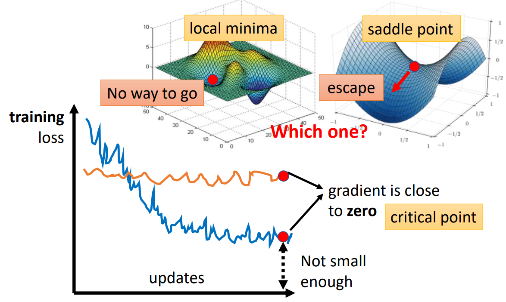
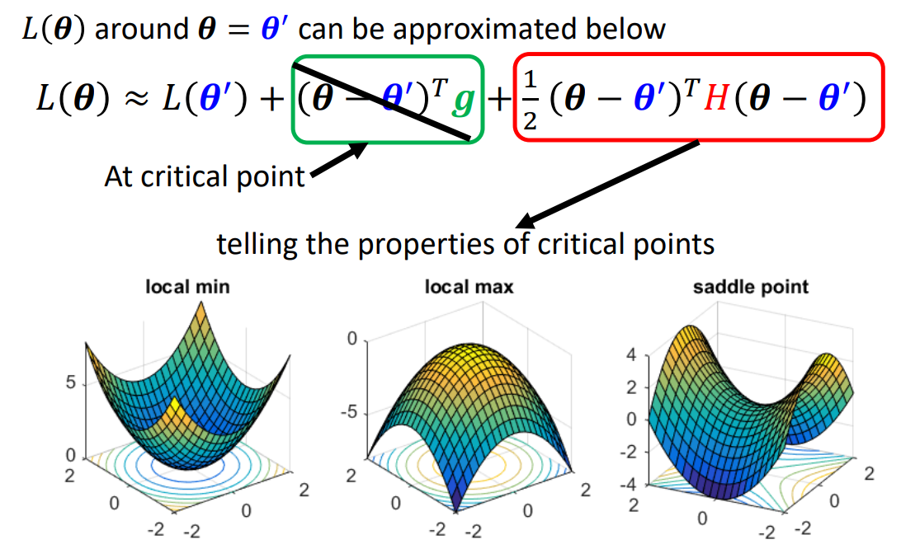
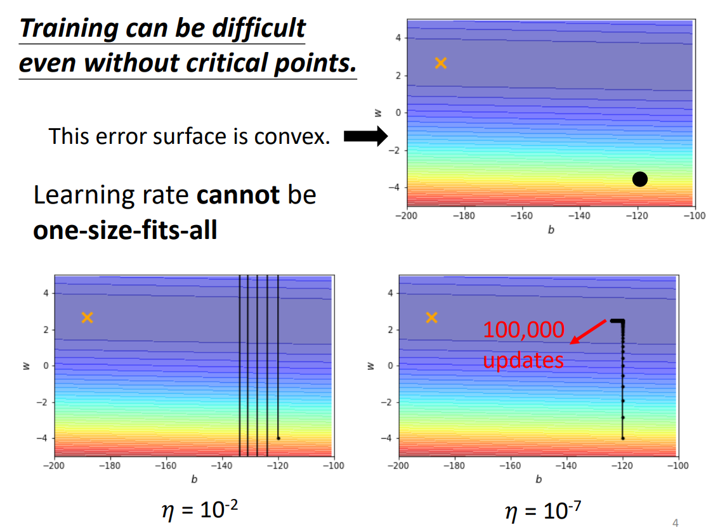
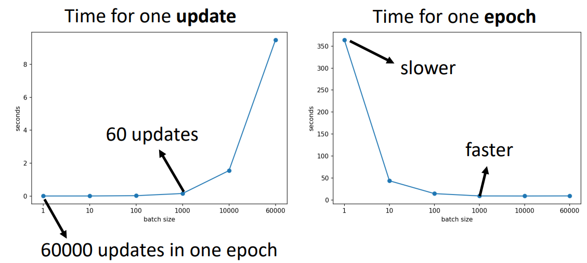

# 模型调整

## 流程

- 若训练集损失大

	- 模型偏见

		使用更复杂的模型。

		- 若复杂模型仍不管用

			将训练数据划分为测试集和验证集用于选择合适的模型。

	- 最优化问题

		更改最优化方法。

- 若训练集损失小，测试集损失小

	- 是为理想结果。

- 若训练集损失小，测试集损失大

	- 过拟合
		- 使用更多训练数据。
		- 减少模型参数。
		- 简化模型。
	- 模型使用错误。

## 梯度问题

### 零梯度

loss 缺乏变动，可能是梯度下降时梯度为 $0$ ，称为到达驻点（Stationary Point），也叫临界点（Critical Point），有两种情况：

- 陷入局部最优解

	局部最优解处无法继续下降。

- 陷入鞍点（Saddle Point）

	鞍点处仍然可以找到一个方向继续下降。

### 鞍点处理

设 $\boldsymbol\theta'$ 为临界点，$\boldsymbol g$ 为梯度，在 $\boldsymbol\theta'$ 处泰勒展开有：
$$
\begin{align}
L(\boldsymbol\theta) & = L(\boldsymbol\theta') +
(\boldsymbol\theta - \boldsymbol\theta')^T \boldsymbol g +
\frac 1 2 (\boldsymbol\theta - \boldsymbol\theta')^T \boldsymbol H (\boldsymbol\theta - \boldsymbol\theta') \\
& = L(\boldsymbol\theta') + 0 + \frac 1 2 \boldsymbol v^T \boldsymbol H \boldsymbol v
\end{align}
$$
其中 $\boldsymbol g$ 为梯度，此时为 $0$，$\boldsymbol H$ 为黑塞矩阵（Hessian，Hessian Matrix）

对于所有 $\boldsymbol v$ ：

- 若 $\boldsymbol v^T \boldsymbol H \boldsymbol v \gt 0$ ，则有所有 $L(\boldsymbol \theta) \gt L(\boldsymbol \theta')$，即为局部最小值。
- 若 $\boldsymbol v^T \boldsymbol H \boldsymbol v \lt 0$ ，则有所有 $L(\boldsymbol \theta) \lt L(\boldsymbol \theta')$，即为局部最大值。

- 有些 $\boldsymbol v$ 使得 $\boldsymbol v^T \boldsymbol H \boldsymbol v \gt 0$ ，有些 $\boldsymbol v$ 使得 $\boldsymbol v^T \boldsymbol H \boldsymbol v \lt 0$ ，则为鞍点。

实际上，要判断 $\boldsymbol v^T \boldsymbol H \boldsymbol v$ 的正负，只需算出 $\boldsymbol H$ 的特征值（Eigenvalue）：

- 特征值全为正（正定），则为局部最小值。
- 特征值全为负，则为局部最大值。
- 特征值有正有负，这位鞍点。

若处在鞍点，还可以由黑塞矩阵 $\boldsymbol H$ 得出参数更新的方向。

设 $\boldsymbol u$ 为 $\boldsymbol H$ 的特征向量（Eigenvector），$\lambda$ 为其对应的特征值。

- 若 $\lambda \lt 0$ ，令 $\boldsymbol\theta - \boldsymbol\theta' = \boldsymbol u$ ，有 $\boldsymbol u^T \boldsymbol H \boldsymbol u = \boldsymbol u^T (\lambda \boldsymbol u) = \lambda ||\boldsymbol u||^2 \lt 0$ ，得：

$$
L(\boldsymbol\theta) = L(\boldsymbol\theta') + \frac 1 2 \boldsymbol u^T \boldsymbol H \boldsymbol u \implies
L(\boldsymbol\theta) \lt L(\boldsymbol\theta')
$$

从而 $\boldsymbol \theta = \boldsymbol \theta' + \boldsymbol u$ ，只需将 $\boldsymbol \theta'$ 往 $\boldsymbol u$ 的方向更新即可继续减少 Loss 。

在实际应用场景中：

- 计算 $\boldsymbol H$ 需要的运算量非常大，还要计算特征值和特征向量，所以会使用其它方法逃离鞍点。
- 低维的局部最小值，在高维度中很可能并不是一个局部最小值，是一个鞍点，实际问题的维度很高，往往局部最优解是比较少的。

### 梯度非常小

error surface 过于平坦，导致参数更新缓慢，建议更换 Loss 。

## Loss 不再减小

可能是：

- 梯度为 $0$ ，不再变化。

	这一般是期望的情况。

- 梯度非常小，变化缓慢。

	考虑优化方法问题。

- 具有一定梯度，但 Loss 变化小

	此时可能是不断在最优解附近震荡，具有一定坡度，但无法到达谷底，考虑动态学习率。

即使是一般凸函数（Convex）上，也可能出现震荡的情况。

如下图，黑点是起点，黄叉是最优解，红色高，紫色底，黄叉上下两侧是山谷状。

- 当学习率设为较大的 $10^{-2}$ 时，Loss 在山谷两侧来回跳动。
- 当学习率设为较小的 $10^{-7}$ 时，Loss 成功走下山坡，但由于学习率非常小，在山谷中的速度极其缓慢。

此时需要使用动态学习率。

## Batch Size

batch size 的选择。

- 计算时间

	大 batch size 更节约计算时间。

- 计算效果

	- 训练效果

		小 batch size 更不易陷入驻点。

	- 测试效果

		小 batch size 训练出的 Loss 泛化能力更强。

### 计算时间

因为 GPU 可以做平行运算，所以计算一个 batch 不一定比计算一个样本（最小的 batch size）的时间长，但 GPU 的并行运算能力有限，当 batch 过大，计算时间仍然会随着 batch size 的变大而变大。

对于 60000 个样本，若将 batch size 设为 1 ，则在一个 epoch 中要进行 60000 次更新，设为 1000 ，只需要 60 次更新，而二者每次更新计算的时间相近：

### 训练效果

大 batch size 往往训练结果或比小 batch size 差，因为小的 batch size 计算出的更新方向的差异更大，更不易在最优化时陷入驻点。

### 测试效果

使用各种方法使得大小 batch size 在训练集上表现差不多时，在测试集上，大的 batch size 往往比小的 batch size 效果差。

陡峭时小的 batch size 容易跳出，大的 batch size 容易沿着 Loss 陷入。

- 小的 btach size 倾向于周围较**平坦的最小值（Flat Minimum）**
- 大的 btach size 倾向于周围较**陡峭的最小值（Sharp Minimum）**

训练集对应的损失函数与测试集对应的损失函数存在一定偏差，Flat Minimum 能更好的减少这种偏差带来的影响。

**Flat Minimum 的泛化能力更强**，这个结论在优化器的效果中也适用。

实线为训练集 Loss ，虚线为测试集 Loss 。

## 类别表示

分类时，多分类不要单个数字表示一个类别，因为相邻数字间具有相邻关系，尽量采用单位向量的方式表示一个类别。

## 正则化

（Regularization）

为损失函数增加正则项，即令 $L_{new} = L_{old} + \sum w^2_i$ ，其中 $w$ 是所有的权值参数。

- 正则项可以使得参数更均匀，从而图像更平滑，增加模型的泛化能力。
- 注意偏置项不要考虑到 $w$ 中，因为偏置项只是调整函数的位置，与函数的平滑程度无关。