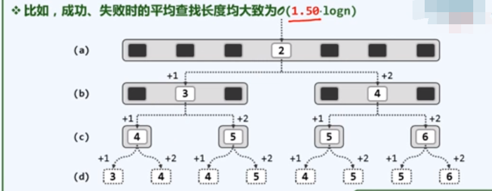
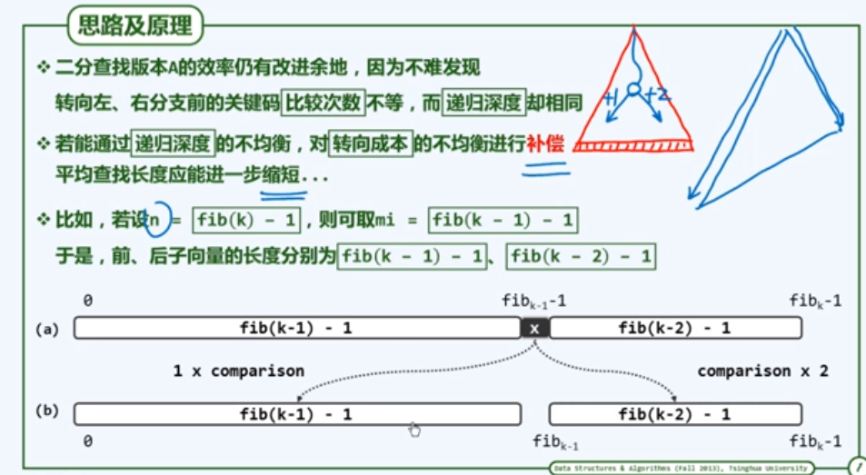
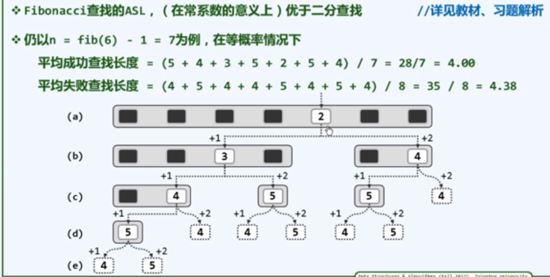
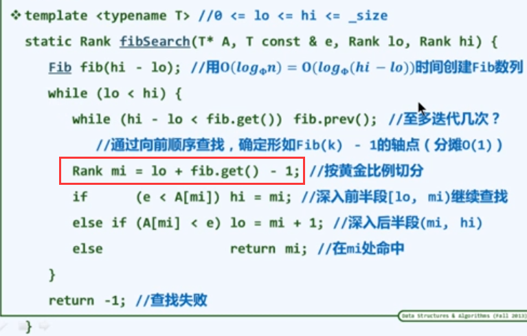
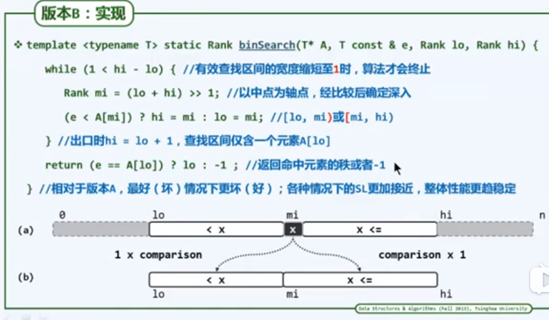

# 二分

二分以二分查找与二分答案为代表，能够对具有广义上的有序性的数据进行 $O(logn)$ 的操作。

若能够确定判断条件后的转移方向，就能够使用二分。

尽量使用双支二分查找，在某些意义复杂的情况下，三支二分查找更适用。

## 二分查找

### 总览，二分查找模板注意点

- 基本框架（死记）
- 区间变换
	- 控制范围（死记 $lo, hi$）
	- 转移方向（分析 $arr[mid]$ 与 $x$ 的大小关系）
- 终止状态
	- 临界出口（一个假设）
	- 查找成功
		- **终止位置**（分析 $arr[mid]$ 与 $x$ 相等时的出口方向）
		- **相等关系**（分析 $arr[mid]$ 为多个相等元素中间那个时的出口方向）
	- 查找失败
		- 失败判定（终止位置元素是否与待查找元素相等）
		- **失败位置**（假设存在 $x$，反转比较条件，分析终止状态的出口方向）
- 意义抽象（特殊分析）

其中，高亮部分是要特别考虑的地方。

### 引例

以下以升序序列为例。

- 约定接口

	`int find ( T A[ ], const T & e, int lo, int hi ); `

	$e$ 为要查找元素，$lo，hi$ 为区间两端下标，注意 $hi$ 为超尾下标。

- 约定返回值

	返回不大于 $e$ 的最后一个元素位置（重复元素时也适用），若第一个元素就大于 $e$，则返回 $-1$。

- 返回值解释

	便于自身维护，假设要插入一个 $e$，则先查找 $e$，然后插入 $e$，以保持次序。

	向量为例：`vector.insert( 1 + find( e, lo, hi ), e );` (只做演示，接口问题忽略)

#### 版本 A（三支二分查找）

不完善，平均时间复杂度：$O(1.5\log n)$。

```c++
template<typename T, typename Rank = int >   // Rank 秩，相当于下标，演示中默认为 int
Rank find( int A[], const T & e, Rank lo, Rank hi ){
    while( lo < hi ){
        int mi = (lo + hi) >> 1;   // mi 为轴，通过右移1位， 平均后向下取整
        if(e < A[mi]){
            hi = mi;
        }else if(A[mi] < e){   //  尽量用小于号，原因：e < A[mi]则 e 在左边，A[mi] < e 则 e 在右边，这样更直观
            lo = mi + 1;
        }else{
            return mi;
        }
    }
    return -1;   //查找失败
}
```

精细地评估性能，主要考查关键码（此例中的e）的比较次数，即查找长度。

下图演示：往左转向需要比较 1 次，往右转向比较 2 次。



#### 斐波拉契查找

平均时间复杂度：$O(1.44\log n)$

通过由斐波拉契数确立的黄金分割点，将查找区间分成不均衡的两段，以此平衡向左比较一次，向右比较两次的不平衡。

下图红三角位上方例子的版本A，蓝三角位斐波拉契查找演示图：

其中 $n$ 为查找区间长度。





实现：（Fib为一个斐波拉契类）



#### 版本B（三支二分查找）

仍不完善，返回值不符要求。

```c++
template<typename T, typename Rank = int >   // Rank 秩，相当于下标，演示中默认为 int
Rank find( int A[], const T & e, Rank lo, Rank hi ){
    while( 1 < hi - lo ){
        Rank mi = (lo + hi) >> 1;
        (e < A[mi]) ? hi = mi : lo = mi;   //注意 hi 始终是超尾的下标
    }
    return (e == A[lo]) ? lo : -1;   //返回-1则查找失败
}
```

原理图：



#### 版本 C（双支二分查找）

在二支的基础上又符合了返回值约定：返回不大于e的最后一个元素下标（若第一个元素就大于e，则返回 -1）。

```c++
template<typename T, typename Rank = int > 
Rank find( int A[], const T & e, Rank lo, Rank hi ){
    while( lo < hi ){ 
        Rank mi = (lo + hi) >> 1;
        (e < A[mi]) ? hi = mi : lo = mi + 1;   //不变性：A[0, lo) <= e < A[hi, n)
    }   //由不变性，标准位置一直处在右方较大元素区间的最前方，直到区间长度缩减为一
    return lo - 1;   //退出循环时 lo 与 hi 相等，而 hi 为超尾值，所以 lo - 1
}
```

原理图：


### 双支二分查找标准模板

#### 标识符建议

 - 左闭右开区间，使用 lo 和 hi 作为标识符。
 - 左闭右闭区间，使用 L 和 R 作为标识符。

在二分查找中，最好都使用左闭右开区间，即 lo 和 hi。

#### 基本框架

```c++
while (lo < hi) {
	mid = (lo + hi) >> 1;
}
```

防溢出：

```c++
while (lo < hi) {
    mid = lo + ((hi - lo) >> 1);
}
```

若遇到浮点数，要用 EPS 控制退出区间的长度。

此时 $lo,mid,hi$ 在终止状态的差距将很小，任意使用一个即可。

```c++
while (lo + EPS < hi) {
	mid = (lo + hi) / 2;   // 浮点数不能移位
    // lo = mid + EPS;
}
```

如果意义不好分析，写三支二分。

#### 区间变换

##### 控制范围

在 `while ( lo < hi )` 下，表达式：`（lo + hi） >> 1;`   （只要写这个形式就要注意这个）只能控制 $[lo, hi)$ （左闭右开）的区间，要注意 $hi$ 的意义。

- 若 hi 是超尾值（右开区间），则其下一步对应值应为：
	`lo = mid + 1;` 或` hi = mid;`其余不变。

- 若 hi 不是超尾值（右闭区间），则其下一步对应值应为：
	`lo = mid + 1;` 或 `hi = mid;`其余不变。
	
	为什么不是 `hi = mid-1;` 呢？因为此处 `hi = mid-1;` 会导致后续的控制范围中，没有此时 `mid-1` 这个位置的数。**此处 $hi$ 发生了意义转变**（从非超尾值变成了超尾值）。
	
	显然，这种写法不利于保持语义一致，因此建议一开始就使用超尾值，在逻辑上更一致更顺畅。
	
	**（这是 `(lo + hi) >> 1;` 形式的表达式造成的结果）**

要注意第二种写法在终止时的范围为 2 。

##### 转移方向

依据 $arr[mid]$ 元素与 $x$（待查找元素） 的大小关系即可判断查找的转移方向。

#### 终止状态

##### 临界出口

在收缩到 $lo$ 与 $hi$ 相邻时（即将退出循环，结束查找），$x$ 一定在 $lo$ 或 $hi$。

为便于终止位置的分析，经总结规律，**假设**此时 $lo$（亦是 $mid$）就是 $x$ 的位置，

事实上，$x$ 有重复值的情况下，$hi$（亦是 $mid+1$）也可能是 $x$ 的位置。

##### 查找成功

###### 终止位置

基于临界出口假设分析：

- 若下一步执行 `lo = mid + 1;`，导致 `lo == hi` 结束循环：终止位置为 $lo - 1$ 也即是 $hi - 1$。
- 若下一步执行 `hi = mid;`，导致 `lo == hi` 结束循环：终止位置为 $lo$ 也即是 $hi$。
- 如前所述，如果一味将终止位置作为 $mid$，则在 $x$ 有重复值时会出错。

###### 相等关系

有相等元素时终止位置是相等元素中第一个还是最后一个？

**假设 $arr[mid]$ 是多个与 $x$ 相等的元素中间的一个元素，**若在 $arr[mid]$ 与 $x$ 的判断条件中，使得区间向后收缩，则终止位置应是相等元素中的最后一个元素；反之，向前收缩则为第一个元素。

##### 查找失败

###### 失败判定

若不一定能找到 $x$，则在退出循环后再判断终止位置元素是否与 $x$ 相等即可。

###### 失败位置

终止状态下，假设存在 $x$，反转比较条件，若区间向后收缩，则升序下终止位置在 $x$ 后（比 $x$ 大）；反之，若区间向前收缩，则升序下终止位置在 $x$ 前（比 $x$ 小）

#### 意义抽象

当比较条件比较的是对应的抽象意义时，终止状态要特殊分析。

### 重要例子分析

#### 例一

```c++
    while (lo < hi) {
        int mid = (lo + hi) >> 1;
        arr[mid] < x ? lo = mid + 1 : hi = mid;
    }
```

- 终止位置

	临界出口时，$arr[mid]$ 应与 $x$ 相等，可知 $arr[mid] < x$ 为 $false$，执行 `hi = mid` 从而退出循环，故这种写法终止位置应该是 $lo$。

- 相等关系

	$arr[mid]$ 与 $x$ 相等时，执行 `hi = mid`，区间向前收缩，故 $x$ 为相等元素中的第一个元素。

- 失败位置

	假设 $x$ 存在，则临界出口时 $arr[mid]$ 应与 $x$ 相等，反转判断条件，$arr[mid] >= x$ 为 $true$，区间向后收缩，故终止位置 $lo$ 应该在 $x$ 后（若升序即大于 $x$ ），即 $arr[lo]$ 应该是 $x$ 后第一个元素。(与 $arr[lo]$ 相等的数有多个时仍然满足）

#### 例二

```c++
    while (lo < hi) {
        int mid = (lo + hi) >> 1;
        arr[mid] <= x ? lo = mid + 1 : hi = mid;
    }
```

-  终止位置

	临界出口时，$arr[mid]$ 应与 $x$ 相等，可知 $arr[mid] <= x$ 为 $true$，执行 `lo = mid + 1` 从而退出循环，故这种写法终止位置应该是 $lo - 1$。

- 相等关系

	$arr[mid]$ 与 $x$ 相等时，执行 `lo = mid  + 1`，区间向后收缩，故 $x$ 为相等元素中的最后一个元素。

- 失败位置

	假设 $x$ 存在，则临界出口时 $arr[mid]$ 应与 $x$ 相等，反转判断条件，$arr[mid] > x$ 为 $false$，区间向前收缩，故终止位置 $lo-1$ 应该在 $x$ 前（若升序即小于 $x$ ），即 $arr[lo-1]$ 应该是 $x$ 前第一个元素。(与 $arr[lo-1]$ 相等的数有多个时仍然满足）

#### 例三

```c++
    while (lo < hi) {
        int mid = (lo + hi) >> 1;
        arr[mid] > x ? hi = mid : lo = mid + 1;
    }
```

- 终止位置

	临界出口时，$arr[mid]$ 应与 $x$ 相等，可知 $arr[mid] > x$ 为 $false$，执行 `lo = mid + 1` 从而退出循环，故这种写法终止位置应该是 $lo - 1$。

- 相等关系

	$arr[mid]$ 与 $x$ 相等时，执行 `lo = mid + 1​`，区间向后收缩，故 $x$ 为相等元素中的最后一个元素。

- 失败位置

	假设 $x$ 存在，则临界出口时 $arr[mid]$ 应与 $x$ 相等，反转判断条件，$arr[mid] <= x$ 为 $true$，区间向前收缩，故终止位置 $lo-1$ 应该在 $x$ 前（若升序即小于 $x$ ），即 $arr[lo-1]$ 应该是 $x$ 前第一个元素。(与 $arr[lo]$ 相等的数有多个时仍然满足）

#### 例四

```c++
    while (lo < hi) {
        int mid = (lo + hi) >> 1;
        arr[mid] >= x ? hi = mid : lo = mid + 1;
    }
```

- 终止位置

	临界出口时，$arr[mid]$ 应与 $x$ 相等，可知 $arr[mid] >= x$ 为 $true$，执行 `hi = mid` 从而退出循环，故这种写法终止位置应该是 $lo$。

- 相等关系

	$arr[mid]$ 与 $x$ 相等时，执行 `hi = mid`，区间向前收缩，故 $x$ 为相等元素中的第一个元素。

- 失败位置

	假设 $x$ 存在，则临界出口时 $arr[mid]$ 应与 $x$ 相等，反转判断条件，$arr[mid] < x$ 为 $false$，区间向后收缩，故终止位置 $lo$ 应该在 $x$ 后（若升序即大于 $x$ ），即 $arr[lo]$ 应该是 $x$ 后第一个元素。(与 $arr[lo]$ 相等的数有多个时仍然满足）

### 补充

若要找一个有序数组中连续出现同一个数字的区间，两次二分查找分别找到起点和终点即可。

## 二分答案

二分答案常用于“最大值最小化”和“最小值最大化”问题。

### 使用条件

- 答案在一个固定区间内。
- 不易确定符合条件的值，但容易确定某个值是否可行。
- 可行解满足一定的单调性，能够在判断后确定进一步尝试的方向。

### $P1873$ 砍树

https://www.luogu.com.cn/problem/P1873

AC 代码：

```c++
#include<iostream>
#include<cstdio>
#include<cstring>
#include<algorithm>

#define ll long long

const int MAXN = 1e6 + 5;
int N, M;
int arr[MAXN];

bool check(int cut) {
    ll count = 0;
    for (int i = 1; i <= N; ++i) {
        count += (arr[i] > cut ? arr[i] - cut: 0);
    }
    return count >= M;
}

int main(void) {
	scanf("%d %d", &N, &M);
	int maxHeight = 0;    // 也可直接以十亿为限，复杂度是完全允许的。
	for (int i = 1; i <= N; ++i) {
		scanf("%d", arr+i);
		maxHeight = std::max(maxHeight, arr[i]);
	}
	int lo = 0, hi = maxHeight + 1, mid;
	while (lo < hi) {
		mid = (lo + hi) >> 1;
        check(mid) ? lo = mid + 1 : hi = mid;
	}
	printf("%d\n", lo-1);

	return 0;
}
```

