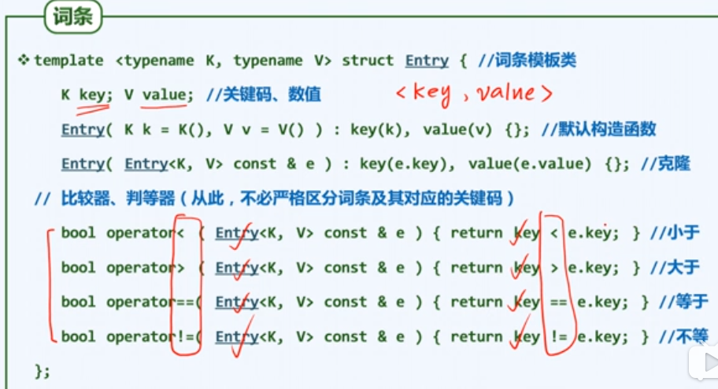
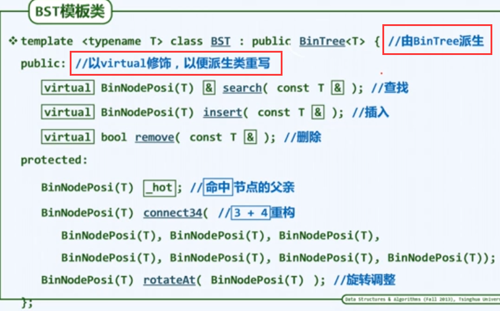
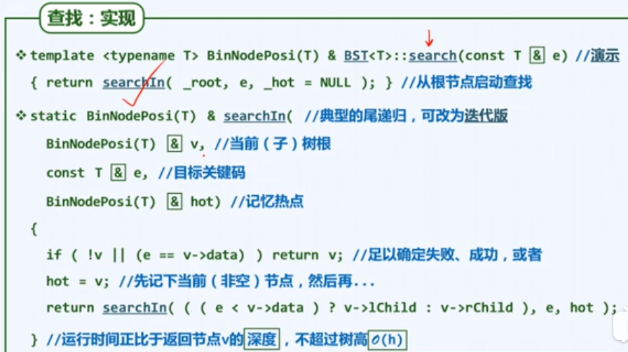
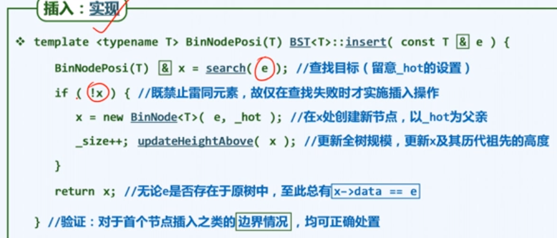
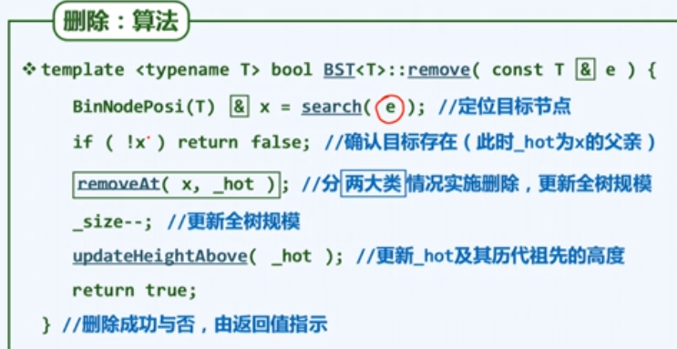
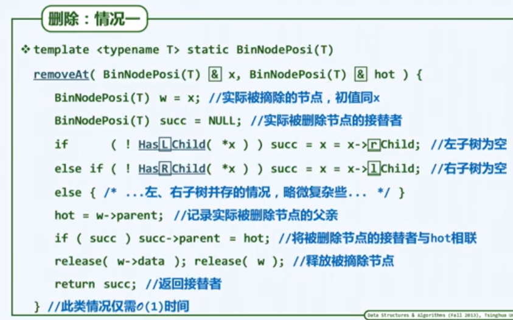
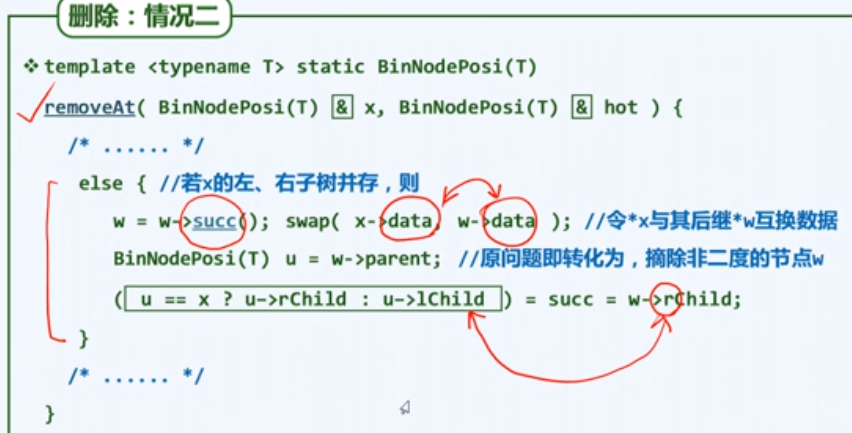
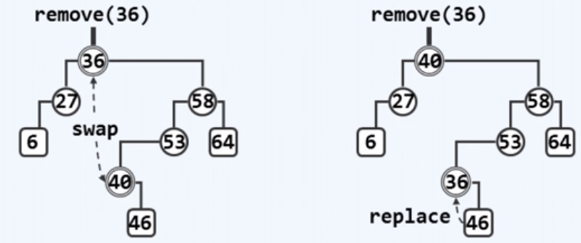

# 二叉搜索树

（Binary Search Tree，BST）也叫二叉排序树。

## 基本概念

- 寻关键码访问（ call-by-key ）
	关键码之间应该能够比较大小和比对相等。
- 词条（entry）
	是含有关键码与数据的项，因关键码可比较，所以词条可比较，词条可作为单独的抽象数据类型传入，为简化，本例未使用。
- 结点
	含有词条（词条就是结合了关键码和数据的类或结构体）或者含有关键码和数据的项。

为简化，本笔记不允许有重复词条（但这种简化在应用中不自然，算法上也没有必要，可添加一个数字记录重复）。

### 顺序性（局部特征）

对于任意一个结点，其左后代结点的值不大于它，右后代结点的值不小于它。

一个错误定义：对于任意一个结点，其左孩子结点的值不大于它，右孩子结点的值不小于它。

### 单调性（全局特征）

BST 的中序遍历序列必定单调非降（充要条件）。

## 词条模板类

词条可作模板数据类型参数使用，为简化，本笔记未使用。

## BST 模板类

上图：BST 有许多变种，所以用虚方法。

## 查找算法

为简化，假设不存在元素相同的结点。

时间复杂度：借助搜索树的顺序性，复杂度不过 $O( h )$, $h$ 为树的高度。

- 返回值
	- 成功时，一个关键码为 e 且真实存在的结点。
	- 失败时，一个指向欲查找结点位置的结点的左指针或右指针引用。
		依失败时的语义，我们可以快速地实现插入算法。

无论成功与否：返回值总是等效地指向命中结点，而 `_hot` 总是指向命中结点的父亲，即使命中结点不存在。

工程上的注意：这个查找算法返回一个具体的指针引用，派生类要覆盖它就也得返回引用，所以最好将这个特殊的搜索算法改名，以便派生类灵活调整返回类型？？？？？？？？？？？？？

## 插入算法

利用上方的查找算法。

注意：“第一个插入”时的边界情况，上方查找算法做出了处理。

## 删除算法

时间复杂度： $O( h )$, $h$ 为树的高度。

两个函数：一个按照数据内容删除，一个按照位置删除，前者借用了查找算法和后者。

### remove

hot 记录被删除结点的父亲。

### removeAt

注意，removeAt 并不是返回中序后继。

1. 有一个孩子为空（共 $2$ 种情况）
2. 两个孩子都不为空
3. 两个孩子都为空，此时以其右孩子（空）作为后继

注意：图中代码有缺陷。忽略了对父结点指针域的处理。

- 注意
	- 情况二中，将待删除结点与其后继交换，这样新的待删除结点的左孩子必为空，从而可以删除。
	- 当待删除结点有两个孩子时才会交换，才会出现新的待删除结点，此时新的待删除结点不可能为根结点

对于待删除结点为根结点时，要分四种情况：

|      | 待删除结点 | 左孩子 | 右孩子 |
| ---- | ---------- | ------ | ------ |
| 1、  | 根结点     | 空     | 空     |
| 2、  | 根结点     | 空     | 不空   |
| 3、  | 根结点     | 不空   | 空     |
| 4、  | 根结点     | 不空   | 不空   |

综合后为两种：（ 1、2、3 ）和（ 4 ）。

- 注意
	- 删除算法使用上方搜索算法时不能用引用接收返回的位置再传递，不然可能释放掉不应该被释放的空间。
	- 因为上方搜索算法返回的是一个指针引用，相当于父结点的一个指针，delete 时会把这个指针释放掉，有可能产生野指针。

## 杂项

以上可知：BST 的各算法时间复杂度取决于其高度。

- 3+4 重构与旋转调整函数的原理见 AVL 树，代码仍在 BST 的头文件中（BST 向 AVL 的转化）。
	AVL 属于 BBST，AVL 继承了 BST，且还有一些树要继承 BST，因此这两个算法方法放到 BST 最好